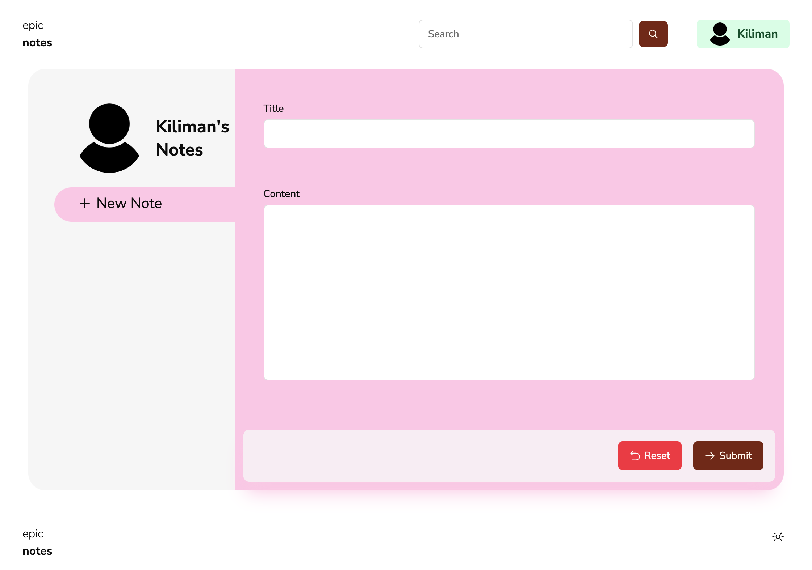
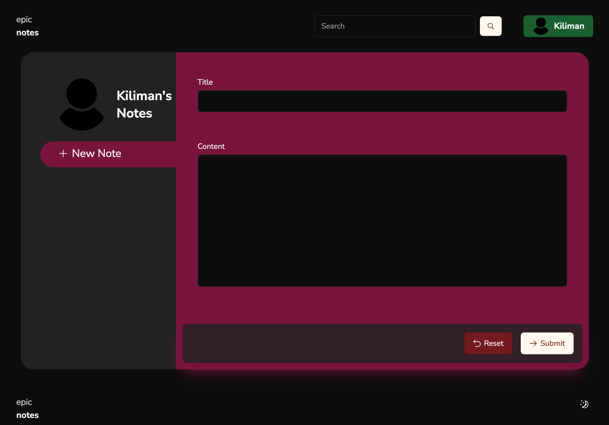

# Epic Stack Custom Theme

This example shows how you can quickly customize the theme colors. We will use
the tool [`shadcn-custom-theme`](https://github.com/kiliman/shadcn-custom-theme)
to generate the CSS block with our custom colors.

The theme template contains the default values.

> NOTE: colors prefixed with `primary`, `secondary`, `accent`, and `gray` will
> be replaced with the color value specified as CLI arguments. All other colors
> will be used directly, like `red-500`.

`other/epic-theme.json`

```json
{
	"light": {
		"--font-sans": "Nunito Sans, Nunito Sans Fallback",
		"--foreground-danger": "red-700",
		"--background": "white",
		"--foreground": "gray-950",
		"--muted": "gray-100",
		"--muted-foreground": "gray-500",
		"--popover": "white",
		"--popover-foreground": "gray-950",
		"--card": "white",
		"--card-foreground": "gray-950",
		"--border": "gray-200",
		"--input": "gray-200",
		"--input-invalid": "red-500",
		"--primary": "primary-900",
		"--primary-foreground": "primary-50",
		"--secondary": "secondary-100",
		"--secondary-foreground": "secondary-900",
		"--accent": "accent-200",
		"--accent-foreground": "accent-900",
		"--destructive": "red-500",
		"--destructive-foreground": "gray-50",
		"--ring": "gray-400",
		"--radius": "0.5rem"
	},
	"dark": {
		"--background": "gray-950",
		"--foreground": "gray-50",
		"--foreground-danger": "red-500",
		"--muted": "gray-800",
		"--muted-foreground": "gray-400",
		"--popover": "gray-950",
		"--popover-foreground": "gray-50",
		"--card": "gray-950",
		"--card-foreground": "gray-50",
		"--border": "gray-800",
		"--input": "gray-800",
		"--input-invalid": "red-900",
		"--primary": "primary-50",
		"--primary-foreground": "primary-900",
		"--secondary": "secondary-800",
		"--secondary-foreground": "secondary-50",
		"--accent": "accent-900",
		"--accent-foreground": "accent-50",
		"--destructive": "red-900",
		"--destructive-foreground": "red-50",
		"--ring": "gray-800"
	}
}
```

## Usage

To generate a custom theme, execute the following command:

```bash
npx shadcn-custom-theme@latest primary=orange secondary=green accent=pink gray=neutral template=other/epic-theme.json
```

This will generate the following CSS block that can be pasted into
`app/styles/tailwind.css`

```css
@layer base {
	:root {
		--font-sans: Nunito Sans, Nunito Sans Fallback;
		--foreground-danger: 0 74% 42% /* red-700 */;
		--background: 0 0% 100% /* white */;
		--foreground: 0 0% 4% /* neutral-950 */;
		--muted: 0 0% 97% /* neutral-100 */;
		--muted-foreground: 0 0% 46% /* neutral-500 */;
		--popover: 0 0% 100% /* white */;
		--popover-foreground: 0 0% 4% /* neutral-950 */;
		--card: 0 0% 100% /* white */;
		--card-foreground: 0 0% 4% /* neutral-950 */;
		--border: 0 0% 90% /* neutral-200 */;
		--input: 0 0% 90% /* neutral-200 */;
		--input-invalid: 0 85% 61% /* red-500 */;
		--primary: 16 75% 28% /* orange-900 */;
		--primary-foreground: 34 100% 97% /* orange-50 */;
		--secondary: 141 85% 93% /* green-100 */;
		--secondary-foreground: 144 62% 21% /* green-900 */;
		--accent: 326 85% 90% /* pink-200 */;
		--accent-foreground: 336 70% 31% /* pink-900 */;
		--destructive: 0 85% 61% /* red-500 */;
		--destructive-foreground: 0 0% 99% /* neutral-50 */;
		--ring: 0 0% 64% /* neutral-400 */;
		--radius: 0.5rem;
	}

	.dark {
		--background: 0 0% 4% /* neutral-950 */;
		--foreground: 0 0% 99% /* neutral-50 */;
		--foreground-danger: 0 85% 61% /* red-500 */;
		--muted: 0 0% 15% /* neutral-800 */;
		--muted-foreground: 0 0% 64% /* neutral-400 */;
		--popover: 0 0% 4% /* neutral-950 */;
		--popover-foreground: 0 0% 99% /* neutral-50 */;
		--card: 0 0% 4% /* neutral-950 */;
		--card-foreground: 0 0% 99% /* neutral-50 */;
		--border: 0 0% 15% /* neutral-800 */;
		--input: 0 0% 15% /* neutral-800 */;
		--input-invalid: 0 63% 31% /* red-900 */;
		--primary: 34 100% 97% /* orange-50 */;
		--primary-foreground: 16 75% 28% /* orange-900 */;
		--secondary: 143 65% 25% /* green-800 */;
		--secondary-foreground: 139 77% 97% /* green-50 */;
		--accent: 336 70% 31% /* pink-900 */;
		--accent-foreground: 328 74% 98% /* pink-50 */;
		--destructive: 0 63% 31% /* red-900 */;
		--destructive-foreground: 0 86% 98% /* red-50 */;
		--ring: 0 0% 15% /* neutral-800 */;
	}
}
```



